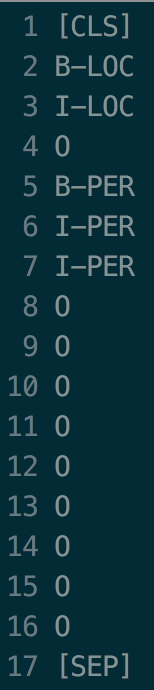

# bert-chinese-ner

## 文件结构

```
.
├── BERT_NER.py              # 训练预测主文件
├── bert                     # Google官方bert文件，git clone https://github.com/google-research/bert.git
├── chinese_L-12_H-768_A-12  # Google官方预训练文件
├── conlleval.pl
├── data                     # 训练数据
├── extract_description.py   # 提取数据需要的字段
├── output                   # 保存了训练的checkpoint、evaluate结果、test结果
├── run.sh                   # 运行模型的bash文件
├── tf_metrics.py            # evaluate使用
└── vocab.txt                # 词典
```

## 前言

使用预训练语言模型BERT做中文NER尝试，fine - tune BERT模型

### Install

```bash
pip install --user -i https://mirrors.aliyun.com/pypi/simple tensorflow==1.15
```

## 使用方法

从[BERT-TF](https://github.com/google-research/bert)下载bert源代码，存放在路径下bert文件夹中

从[BERT-Base Chinese](https://storage.googleapis.com/bert_models/2018_11_03/chinese_L-12_H-768_A-12.zip)下载模型，存放在checkpoint文件夹下

使用BIO数据标注模式，使用人民日报经典数据

train：

```
bash run.sh
```

run.sh中的训练命令：

```bash
python BERT_NER.py \
    --task_name=NER \
    --do_lower_case=True \
    --do_train=False \
    --do_eval=True \
    --do_predict=True \
    --train_batch_size=32 \
    --eval_batch_size=8 \
    --predict_batch_size=8 \
    --data_dir=data/ \
    --vocab_file=chinese_L-12_H-768_A-12/vocab.txt \
    --bert_config_file=chinese_L-12_H-768_A-12/bert_config.json \
    --init_checkpoint=chinese_L-12_H-768_A-12/bert_model.ckpt \
    --max_seq_length=128   \
    --learning_rate=2e-5   \
    --num_train_epochs=1.0 \
    --output_dir=./output/result_dir/ \
```

### 训练集格式

每句字后面是标签，多个句子按照空行分隔。
```
你 O
好 O

世 O
界 O
```

### 预测自己的数据

预测自己的数据需要将数据构造成训练集的格式，如下所示，其中的O只是占位符的作用模拟训练集的标签，没有实际意义。

```
你 O
好 O
世 O
界 O
```

## 结果

经过100个epoch跑出来的结果

```
eval_f = 0.9662649
eval_precision = 0.9668882
eval_recall = 0.9656949
global_step = 135181
loss = 40.160034
```

测试结果第一句：




## 代码参考

- [BERT-NER](https://github.com/kyzhouhzau/BERT-NER)
- [BERT-TF](https://github.com/google-research/bert)
- [bert-chinese-ner](https://github.com/ProHiryu/bert-chinese-ner)

PS: 移步最新[**albert fine-tune ner**](https://github.com/ProHiryu/albert-chinese-ner)模型